The Evolution of U.S. Book Retailer Sales 1992-2022
================
Emilio Avalos, Jaime Fastino, Nicole Romangsuriat
05/01/2023

## Introduction

In this document we will be analyzing the monthly retail sales of
bookstores in the United states from January 1992 to December 2022.
Given the technological innovations that have popularized kindle and
other e-reading platforms over the past years, we would like to
investigate how book retailer sales have been impacted. We hypothesize
that the emergence of bookstore alternatives such as e-book reading
platforms (eg. Kindle and Wattpad) and digital comic platforms (eg.
Webtoon) in the 2010s have caused brick-and-mortar bookstore sales to
dwindle in recent years. However we are taking this analysis further
back by exploring bookstore sales from 1992 to 2022, to see how factors
such as increases in technological advancements, education access, and
U.S. literacy rates, have influenced book retail store sales within
these two decades.

We will start by generating a time series plot and conducting
qualitative analysis to investigate topics such as trend, cyclic
behavior, and seasonality. In the second part of the analysis, we will
investigate various models including baseline models, time series
decomposition, exponential smoothing, the SARIMA family, linear
regression, and non-linear models. After this investigation, we will
then compare in-sample accuracies to determine which model has the best
fit.

## About the Data Set

We are utilizing data from the U.S. Census Bureau website, particularly
from the “Retail Food and Services Sales” dataset. The U.S. Census
Bureau had collected this data from the Monthly Retail Trade Survey,
Annual Retail Trade Survey, Service Annual Survey, and national
administrative records. This dataset provides monthly sales data from
1992 to 2022 for each type of store under this category, including data
for bookstore sales. We pulled this data and compiled it into a separate
dataset with 372 data values.

## U.S. Monthly Bookstore Sales Time Series Plot

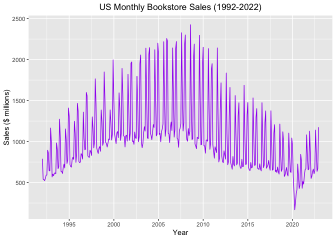

## Qualitative Analysis

By doing an initial assessment of this time series graph, its properties
can be summarized as follows:

- **Trend:** A non-constant trend is evident in this dataset. The data
  appears to increase from 1992 to around 2008, illustrating a vast
  increase in bookstore retail sales during this time period. The end of
  the 1990s and the start of the new millennium was the world had
  entered into a global Information Age, in which nation-wide education
  levels had increased with greater funding in U.S. public schools,
  post-secondary level tuition grants, and advancements in formal
  education (National Archives and Records Administration). This is
  likely attributed to the increase in education rates and literacy
  rates, hence increasing the portion of the population who purchases
  books from book retailers. Data levels decrease slowly from around
  2008 to 2020. This is likely attributed to the increase in e-book
  platforms at the time. Sony had released its first e-reader in 2006
  while Amazon had launched its kindle in 2007 (Atwell, 2023). These
  devices became popular around 2008 as more people started using it in
  lieu of going to the bookstore and picking a paperback copy off the
  shelves. E-books can be preferable as they are less expensive, can fit
  into any device as long as there is enough storage, and does not
  require physical space or carry any weight in your bag. Other
  e-reading platforms such as Wattpad, an online platform in which
  writers can publish and share their own stories, as well as
  alternatives such as audiobooks and digital graphic comic apps have
  also started to increase in popularity, driving customers away from
  the traditional brick-and-mortar bookstore. The data suddenly drops in
  2020, likely due to the COVID pandemic and subsequent lockdowns that
  prevent people from stepping outside their homes into public places,
  causing bookstore sales to plummet. The data then slowly increases as
  the pandemic ends, illustrating people visiting bookstores once more.
  This continues until the end of 2022, which could be because of the
  current trend of buying secondhand books from local mom-and-pop
  stores. There was and currently is a trend of buying secondhand
  products as a way to decrease waste and be more environmentally
  conscious. This has extended to increasing the shelf life of books, as
  demonstrated by a 5.5% increase in the secondhand book industry in
  2022 alone (Talbot, 2022).

- **Level:** There is a non-constant level that is evident in the
  dataset. From 1992 to roughly 2008, the data level increases gradually
  from \$750 million to \$1.75 billion, as U.S. education levels and
  literacy rates rise. It then decreases to roughly \$775 million until
  around 2020, as e-readers and online book platforms and alternatives
  are popularized, before dropping to roughly \$200 million as the
  pandemic causes brick-and-mortar bookstores to close. The data level
  finally increases gradually once more to roughly \$900 million as
  purchasing secondhand books are becoming a trend.

- **Cyclical Behaviour:** There appears to be little cyclic behaviour
  present in the dataset. There is little to no irregular data level
  variation, as most if not all of the fluctuations appear to occur in a
  repeating pattern in the time series plot.

- **Outliers:** There is an outlier present in 2020. During this time,
  there is a sharp drop in data values from \$1 billion in February 2020
  to \$200 million in March 2020 that is likely because of the COVID-19
  pandemic panic. The month of March had started what most people
  associate with the start of COVID in the U.S., when the pandemic has
  taken its turn for the worst and had resulted in subsequent lockdowns
  and quarantine procedures. Around this time, people were not leaving
  their houses and therefore not going to birkc-and-mortar book stores
  which caused sales to drop. We can see an increase in data levels for
  the next coming months as retail stores start to open and people
  become more comfortable with going outside into public places again.

- **Seasonality:** There is significant seasonality evident in the
  dataset, specifically annual seasonality. There are giant data
  fluctuations from roughly hundreds of millions of dollars to billions
  of dollars that seem to occur on a yearly basis. For each data
  fluctuation that happens per year, it looks like there are 2 specific
  spikes in data. From 1992 to 2000, the latter spike is almost twice
  the size of the first spike. From 2000 to 2008, these two spikes reach
  roughly similar peaks, and from 2008 until the end of 2022, the latter
  spike is either slightly higher than the first or is roughyl the same.
  The first spike could be because of the spring semester or quarter
  start dates of schools and universities throughout the nation, that
  cause tens of millions of students to go book retailers for
  “back-to-school” supplies such as textbooks, notebooks, literary works
  for assignments, stationary, and more. As most schools in the U.S.
  have similar start dates in the spring sometime in January, this
  likely caused an drastic increase in book retailer sales. The second
  spike could also be attributed to “back-to-school season” for the fall
  semester. Most U.S. schools and academic institutions start their fall
  semesters in late August or mid September, likely causing a sudden
  spike in bookstore visits and subsequent retail sales. Unlike the
  first spike in data for each year, the second spike in data is
  followed by relatively low data points for some time, which would make
  sense as this is around the November and December holiday season as
  students are spending this time with families and not doing work.
  These lower data points are not seen as much in between te first and
  second data spikes per year around the summer seasons, as students may
  be pursuing other academic endeavors such as summer classes and
  fellowship programs, which would prevent bookstore retail sales from
  dwindling significantly. It is undetermined on why the spikes in data
  have evolved from being higher in the fall season of each year, to
  being either slightly higher in the spring season or generally the
  same for both seasons.

Given the non-constant seasonality present in the dataset, we
investigate seasonality further by constructing seasonal plots.

## Annual Seasonality

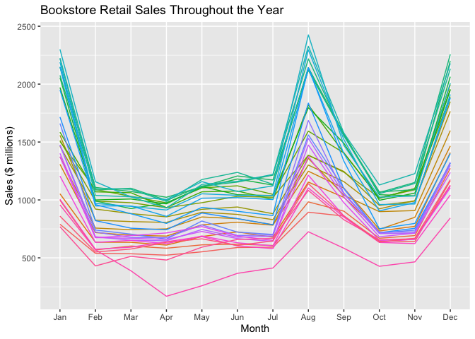

The seasonal plot confirms the yearly seasonality that is present in the
dataset. Data levels are extremely high in January, indicating greater
visits and sales from students who are buying “back-to-school” supplies
for the spring semester and quarter. The levels then drop and stay
constant until July, as students have already stocked up on their school
supplies and book needs for the rest of the spring season, and are
taking some time off in the early summer months. Data levels then
increase until peaking in August, when students are once more purchasing
their school needs for the fall semester, before dropping down until
October, illustrating students having bought all of their supplies once
more. The data level then increase slightly until November, before
spiking up in December. This increase might be because of holiday
shopping. People would be buying their christmas gifts around this time,
causing bookstore retail sales to jump during this season. It is
interesting to see that the two peaks evident in this plot are not only
occuring in January and August, as it was inferred from the qualitative
description, but also occuring in December due to christmas gift
shopping.

We now consider baseline models to compare to other applied models that
would be appropriate for our dataset.

## Baseline Models

We now look at three simple prediction strategies:

1.  **Naive:** The naive approach considers what happened in the
    previous period in each in-sample prediction and predicts the same
    thing will happen again.  
    $$
    \hat x_t = x_{t-1}
    $$ This strategy likely isn’t appropriate for the sales data since
    the data has seasonality and the seasonal effect appears to be
    relatively large. Sales in one year are more likely related to the
    number of sales the year earlier.However, it is best practice for
    analysts to use the Naive approach to utilize as a baseline to
    compare against more sophisticated models.

2.  **Seasonal Naive** A seasonal naive strategy is the most recently
    observed value in each in-sample prediction in the same season. $$
    \hat x_t = x_{t-s}
    $$ In the absence of clear trend yet strong seasonality, this would
    be an appropriate strategy. As previously stated, sales one year are
    likely related to the number of sales the year prior except for
    exceptional cases like holidays, pandemics or periods of severe
    economic crises.

3.  **Constant Mean** A constant mean model is each in-sample prediction
    is the average of all observed data: $$
    \hat x_t = \bar x
    $$ This likely will not implement well since seasonality is present.
    Sales on a given year are better predicted using recent numbers of
    sales from previous month or year, rather than an average.

The in-sample root mean squared error (RMSE) for naive, seasonal naive,
and constant mean prediction methods are 437.41, 112.01, and 434.57. The
lowest RMSE value is for the seasonal naive method at 112.01, which
confirms our initial assumption that it is the most accurate method.

## Decomposition Model - Classical Fit

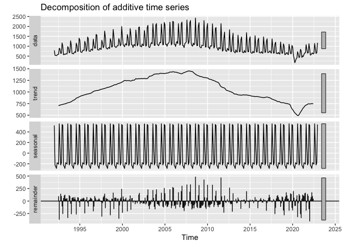

It is evident in the graphs above that there is trend and seasonality
present. We also can calculate the strength of trend of the
decomposition to be 0.7995907 and the strength of seasonality to be
0.8656588. With the strength of seasonality being so close to 1, it is
indicating that there is strong seasonality present like we assumed in
the qualitative analysis. However, we can observe from the remainder
that seasonality was not fully removed. There is a wave like pattern
presenting itself that indicates leftover seasonality, which means that
there was non-constant seasonality in our dataset. The calculated value
for trend for the classical fit demonstrates a weaker trend when
compared to the STL fit below.

## Decomposition Model - STL Fitting

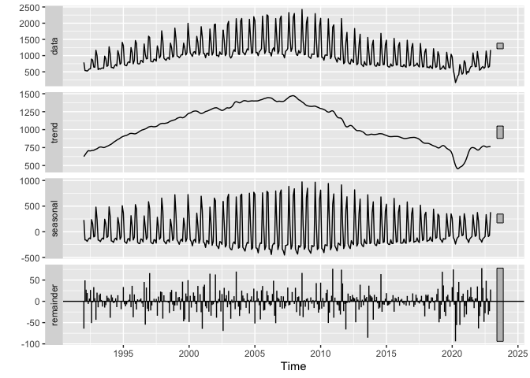

We can tell by these plots that the STL decomposition captures
seasonality better than the classical fit. In looking at the graphs, we
see a difference in the seasonal graph from the one generated in the
classical fit.The seasonal graph in the STL fitting illustrates
non-constant seasonality, and also tapers off at the end which captures
how our time series plot presents the data. In addition, the STL fitting
has a better axis value to capture the range of seasonality. We can also
calculate the strength of trend of the decomposition to be 0.990092 and
the strength of seasonality to be 0.9943317. Our calculated values for
strength of trend and seasonality are different from the STL versus the
classic. Both trend and seasonality are a lot higher in the STL
decomposition, with both being almost 1. In general, the STL model
usually performs better with respect to unusual observations and it is
more computationally intensive. This STL fit allows seasonality to
change, which is therefore more accurate for our dataset. We can confirm
in this decomposition that the data has strong trend and seasonality.

## Exponential Smoothing Models

The three exponential smoothing models include the non constant level or
simple model, the Holt or double model, and the Holt-Winters or triple
model. The non constant level model utilizes exponentially weighted
averages of historical data to place an extra weight on recent
observations. It is unsuitable for our dataset as this model is best for
datasets with non constant level without trend or seasonality. The Holt
model uses exponentially weighted averages of historical data as well,
although it also uses them to update both level and slope. It is also
unsuitable as it is best used for datasets with non-constant level,
trend, and no seasonality. The Holt-Winters model uses exponentially
weighted averages of historical data to update level, slope, and
seasonality. It allows non-constant level, trend, and seasonality, and
is hence the most suitable exponentially smoothing model. We therefore
apply the Holt Winters model as the exponential smoothing model for this
dataset.

Looking at the smoothing parameters for the Holt-Winters model for this
dataset, we can see the following values: alpha = 0.2527, beta = 0.0032,
gamma = 0.7417. The value of alpha is low and closer to 1, suggesting
that there is some smoothing of the level. This makes sense considering
that the level is non-constant, but does not vary significantly. The
beta value is similarly small, at a lesser value that is extremely close
to 0, suggesting that there is little smoothing of the slope. This is
understandable as albeit non-constant trend being evident, trend is not
a drastic element overall, as seen by the gentle slopes in the time
series plot. In contrast, the gamma value is large and closer to 1,
suggesting that there is significant smoothing of seasonality. This once
again makes sense, considering the extreme drastic levels of
non-constant seasonality that is present in the dataset.

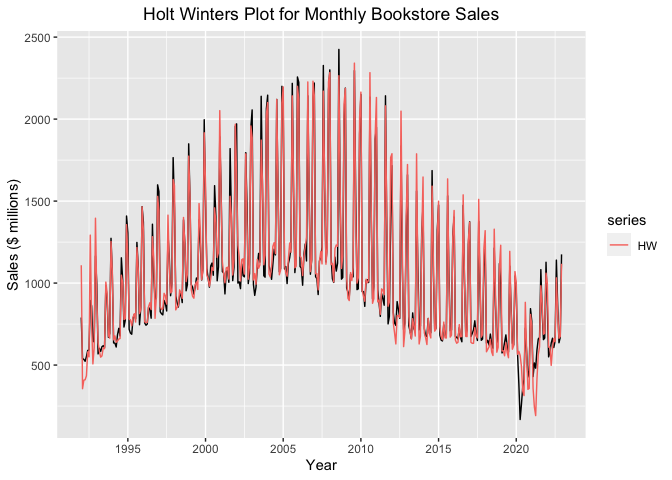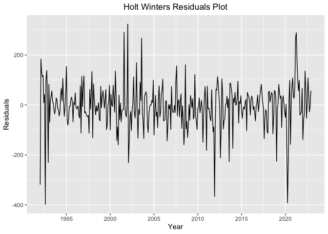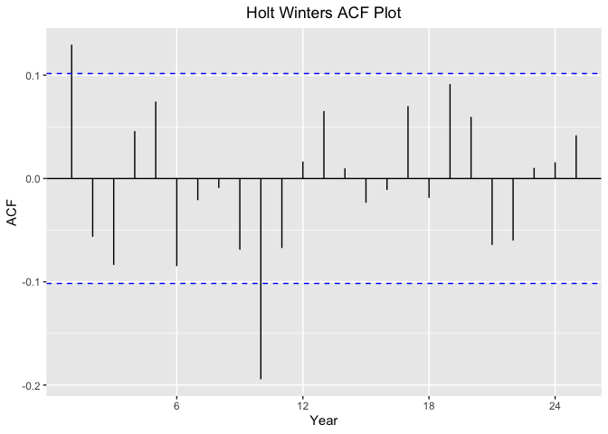

The Holt-Winters model has a relatively good fit with the dataset, with
an RMSE value of 87.71564 that i relatively low considering the high
values in the dataset. This is also seen in how the generated
Holt-Winters plot matches up extremely well with the time series plot,
illustrating that at first glance, this model is an excellent fit for
exponential smoothing. The only sections in which the Holt-Winters plot
differs slightly from the original time series plot is the start and the
outlier in 2020. The Holt-Winters plot has greater data fluctuations in
around 1992 and 1993, as well as in 2020. The good model fit is
supported in the first residual plots, which demonstrates Gaussian white
noise and a relatively stationary plot. However, there are certain
points in this plot that varies significantly, with residuals of -400
around 1993, 2012, and 2020 (although this was an indicated outlier).
The correlogram demonstrating ACF values has slightly different results.
This plot does not illustrate clear white noise and also illustrates
evidence of slight autocorrelation at lag 1 of close to 0.125 and of
strong autocorrelation at lag 10 of close to -0.2. This indicates that
model assumptions are violated and that prediction intervals are less
trustworthy, which calls into question any coefficients that were barely
statistically sig would be called into question.

We now consider the SARIMA family of models to remove the
autocorrelation present in the residuals.

## SARIMA Family of Models

### SARIMA Model I (Investigation)

The SARIMA family of models is a great option when dealing with time
series that have non-constant level, changing trend, and seasonality. As
a first step, an initial fitting algorithm will be ran in R - this
algorithm selects orders of differencing to make the data stationary,
then selects autoregressive and moving average values based on criteria
such as AIC. This algorithm will give an initial recommendation on what
SARIMA combination to use and then we’ll tweak the parameters to try to
improve the model.

    ## Series: BookSales 
    ## ARIMA(1,1,1)(0,1,1)[12] 
    ## 
    ## Coefficients:
    ##          ar1      ma1     sma1
    ##       0.2228  -0.7483  -0.1787
    ## s.e.  0.1011   0.0776   0.0507
    ## 
    ## sigma^2 = 6819:  log likelihood = -2092.89
    ## AIC=4193.78   AICc=4193.89   BIC=4209.31

The initial model is ARIMA(1,1,1)(0,1,1)\[12\]. This means that:

ARIMA(p,d,q)(P,D,Q)\[s\] where: p = autoregressive terms for the time
series \| d = order of differencing to make the data stationary \| q =
moving average terms for the time series errors \| P = autoregressive
terms for seasonality \| D = order of differencing to account for
seasonality and make it stationary \| Q = moving average terms for the
seasonality errors \| \[s\] = frequency of the seasonality.

What the initial model is telling us is that it is taking a first order
difference of the time series and the seasonality to make the data
stationary. After that, it applies one autoregressive term for the data
itself and none for the seasonality component. Also, it applies a moving
average model on the errors with one moving average term for the time
series while also applying the same amount for the seasonality. In this
time series, the seasonality is taken into account every 12 months.

Now, let’s dig further to determine if these terms are statistically
significant:

    ##            2.5 %      97.5 %
    ## ar1   0.02474283  0.42093611
    ## ma1  -0.90036984 -0.59620321
    ## sma1 -0.27821075 -0.07927593

As we can tell by the confidence intervals, the autoregressive term for
the time series (ar1) and both of the moving average components (ma1 &
sma1) are statistically significant since 0 is not present in their
significance range.

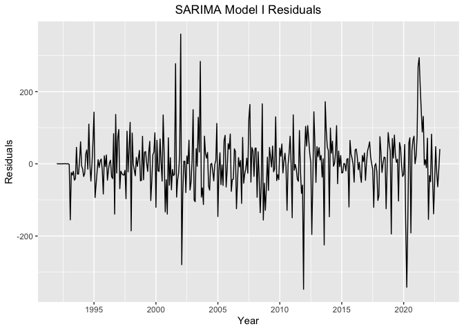

By analyzing the residuals plot for SARIMA Model I, we can determine
that the residuals look stationary with the mean centered around zero
and somewhat constant variance except for outliers with extreme values
in the years of 2002, 2012, 2020, and 2021.

The correlogram for the residuals of this model seems to exhibit
positive autocorrelation at lag 5 and negative autocorrelation at lags
10, 13, and 14.

Overall, this initial model seems like a good starting point since the
autoregressive and moving average terms were statistically significant.
Furthermore, the residuals do demonstrate stationarity but with some
levels of autocorrelation still present. The accuracy Root Mean Squared
Error (RMSE) for this model has a value of 80.78. We will attempt to
improve this model by looking into other SARIMA models in this section.

### SARIMA Model II

For this model, we will test a ARIMA(1,1,1)(1,1,1)\[12\]. In here, we
are increasing the autoregressive term for the seasonal component by
one.

    ## 
    ## Call:
    ## arima(x = BookSales, order = c(1, 1, 1), seasonal = list(order = c(1, 1, 1)), 
    ##     include.mean = FALSE)
    ## 
    ## Coefficients:
    ##          ar1      ma1     sar1    sma1
    ##       0.2122  -0.7492  -0.3203  0.1237
    ## s.e.  0.0970   0.0734   0.2201  0.2269
    ## 
    ## sigma^2 estimated as 6729:  log likelihood = -2092.06,  aic = 4194.12

These are the coefficients for the SARIMA Model II. Below we will test
for their significance:

    ##            2.5 %     97.5 %
    ## ar1   0.02209938  0.4023747
    ## ma1  -0.89294006 -0.6053881
    ## sar1 -0.75165499  0.1110372
    ## sma1 -0.32112825  0.5684556

By testing for significance, we can determine that adding the seasonal
autoregressive term (sar1) is not significant and should not be
included. We will not display the graph of residuals or correlogram for
to avoid redundancy as it is similar to the SARIMA I model. We did get a
lower RMSE value of 80.58 for this model (technically showing a slightly
improved in-sample accuracy), but the insignificant seasonal
autoregressive term makes this accuracy measure untrustworthy.

**Most Successful Model of the SARIMA Family of Models:** Our
investigation of the SARIMA Family of Models has led us to conclude that
the most successful model was the SARIMA Model I:
SARIMA(1,1,1)(0,1,1)\[12\] with an in-sample accuracy RMSE of 80.78. The
fitted SARIMA model on the time series is graphed below.

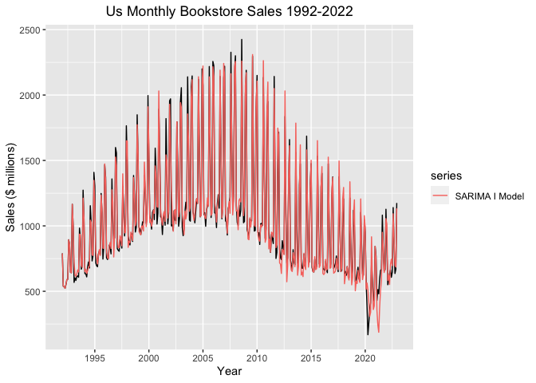

## Linear Regression

Linear models for time series have the ability to include both trend and
seasonality in its calculations. Since our time series data seems to
exhibit a quadratic shape, we will transform the trend to include a
quadratic term in the regression.

The fitted linear model can be described using the following equation:

$$
BookSales = 1,555.38-1,501.30trend-4,358.98trend^2- 734.46S_2 - 755.69S_3 - 791.19S_4 - 685.81S_5 -691.71S_6- 708.89S_7 + 45.20S_8
$$

$$
-369.18S_9 - 720.77S_{10} - 681.04S_{11} + 38.01S_{12}
$$

In this model, S2-S12 represent the seasonal effect for the months of
February - December (January is the base case). All of the variables are
significant at the 99% confidence level except for the months of August
(S8) and December (S12). Of all the months, April shows the least amount
of sales with a value of \$791 million less than in January. On the
other hand, the highest amount of sales are during the month of August
and December having \$452,000 and \$380,000 more in sales than January
respectively. However, as mentioned before, these coefficients are not
statistically significant but could be because of the high volatility
that the data experiences during those periods. The multiple R-squared
value for this model is 0.8543, which means it can explain 85.43% of the
variations in book sales given the variations of the time series’ trend
and seasonality. Finally, the in-sample accuracy RMSE exhibits a value
of 165.88.

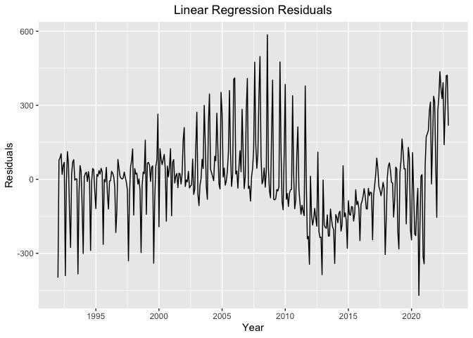

By analyzing the residuals, we see that they are somewhat stationary and
variation seems relatively constant. However, there still seems to exist
some varying trend and non-constant level affecting the residuals given
that they don’t seem to be centered around mean zero. Below we will
proceed to analyze the residuals’ autocorrelation.

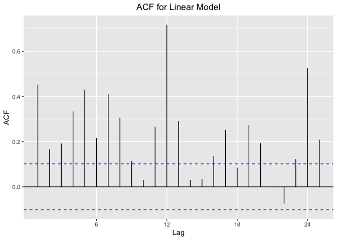

The correlogram demonstrates that there are considerable amounts of
autocorrelation which means that the independence assumption of linear
regression is violated and the significance of the terms are not
reliable. However, we can fit a SARIMA model on the residuals to be able
to make corrections to the initial model.

### SARIMA Model on Residuals

The SARIMA model that will be fit on the residuals is
ARIMA(3,0,3)(0,1,1)\[12\]. We are taking one seasonal differencing to
make the residuals stationary and one moving average seasonal term.
Furthermore, we are applying three autoregressive and three moving
average terms to the residuals time series.

    ##           2.5 %     97.5 %
    ## ar1   0.6229167  0.8502355
    ## ar2  -0.8411716 -0.5914369
    ## ar3   0.7190789  0.9013933
    ## ma1  -0.3991992 -0.1348645
    ## ma2   0.6476052  0.8238004
    ## ma3  -0.6613514 -0.4370853
    ## sma1 -0.3216259 -0.1091559

The confidence intervals of the SARIMA model on the residuals shows that
all of the terms are within the significance range.

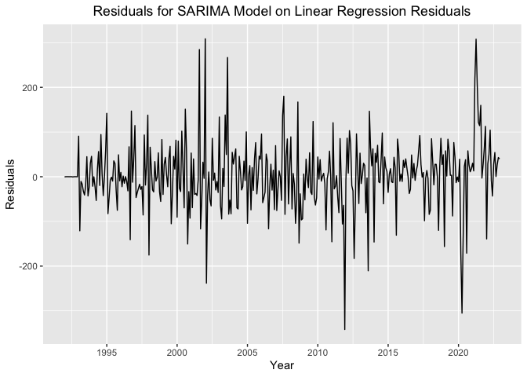

As we can see, the residuals plot has greatly improved by having the
residuals centered around mean zero. Now, we can check if the
autocorrelation has been fixed.

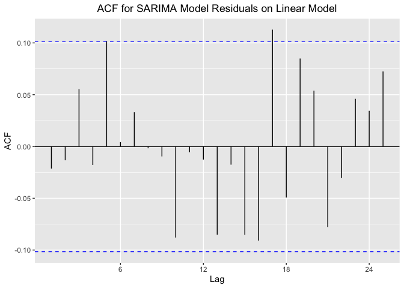

We can see that modeling the linear regression’s residuals with a SARIMA
model significantly improved the autocorrelation, having the ACF
measures contained within the significance range.

### Linear Model with SARIMA for Residuals

As discussed in this section, we have determined that fitting an ARIMA
(3,0,3)(0,1,1)\[12\] model on the linear model’s residuals is successful
and significantly improved the strength and reliability of the model.
Even when comparing in-sample accuracies, the linear model went from an
RMSE of 165.88 to 76.65, an improvement of 53.79%.

The corrected linear model is graphed below.

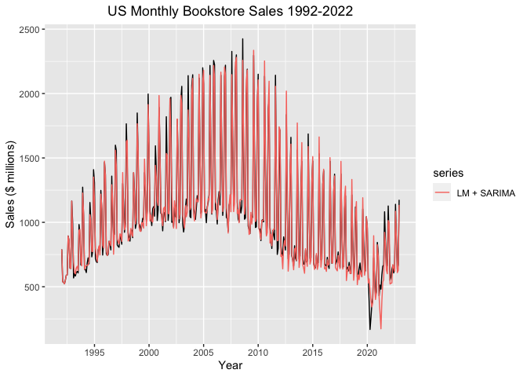

## Extra Topic: Linear Regression with Box Cox Transformation

We will now consider a Box Cox transformation to address non-constant
variance in our dataset, which we will apply to consequent model
fittings. We will follow the same type of model used in the linear
regression section by including a quadratic term for the trend and
having seasonality as dummy variables.

The Box Cox transformation converts non-normal data into a normal
distribution, improving the accuracy of predictions made using linear
regression. It might therefore be a good statistical technique for
datasets with non-constant variance. Given that our data exhibits some
of this quality, the Box Cox transformation could be a good tool to
utilize.

The following Box Cox plot illustrates a flatter curve with smaller
annual data fluctuations, due to the non-constant variance that has been
removed. We apply this transformation onto our linear regression as an
extra factor to potentially increases model fit and in-sample accuracy.

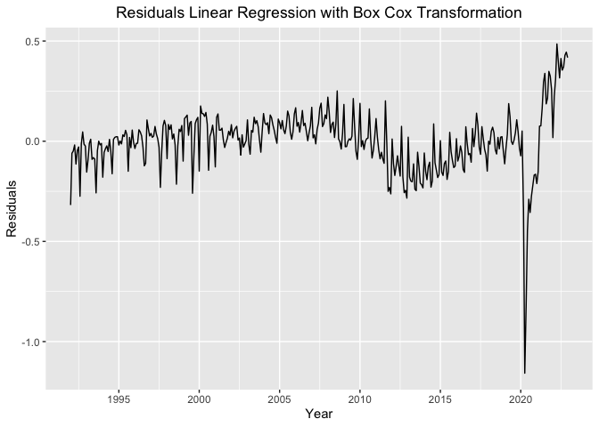

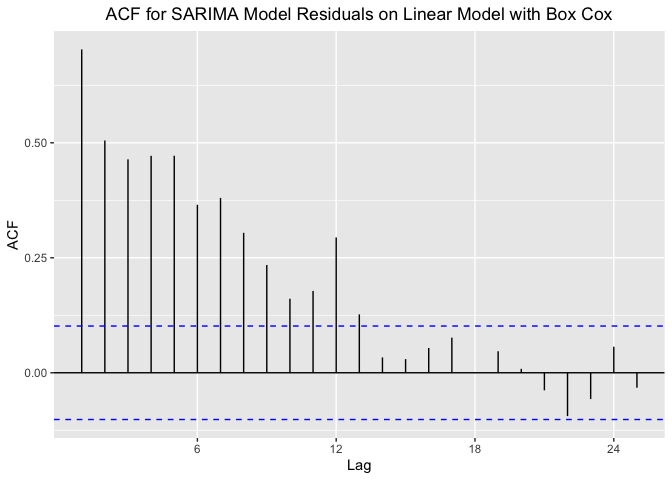
The linear regression with Box-Cox transformation illustrates a flatter
curve with more controlled variance and smaller annual data
fluctuations, due to the non-constant variance that has been removed.
All of the variables seem to be significant except for the seasonal
dummy terms for the months of August and December. Also, it has Multiple
R-squared value of 0.8735 which means this model can explain 87.35% of
the variations in the response variable given changes in the explanatory
variables.

However, by looking at the residuals and correlogram, it still shows
significant autocorrelation and might need to conduct a quick SARIMA
Model on the residuals.

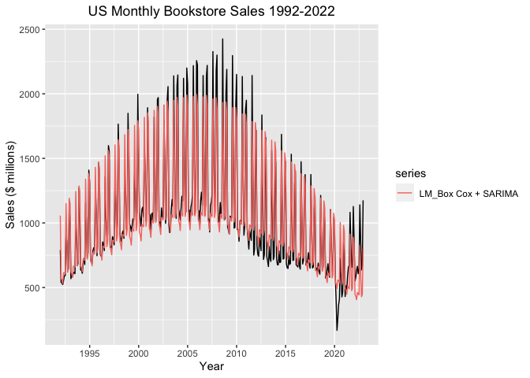

After determining an ARIMA(1,0,2)(1,0,2)\[12\] model on the residuals
and applying the corrections to the linear regression model, we get an
RMSE of 127.89. Overall, the in-sample predictions for the Box-Cox
linear regression model are not as good when compared to our previous
linear regression model (with an RMSE of 76.58). This could be due to
the fact that by looking at the plots, we can see that the Box-Cox
transformation is missing some of the volatility in the actual time
series.

We now move on to exploring our last section of models, which is
non-linear regression.

## Non-linear Regression

For this section, we apply the quadratic formula onto our dataset, as
this formula has an “upside down U” shape that is similar to our time
series plot. We had considered looking into the Bass model, a model for
product lifecycle introduced by Frank Bass which is useful for
estimating future sales, market sizes, and product lifetimes. The model
considers two types of customers, which are the innovators who purchase
products based on product information and advertisements, and the
imitators who purchase products based on others’ experiences and product
usage. As our dataset considers bookstore retail sales, this
consideration of the two customer types therefore does not apply to this
situation, which is why we decided against plotting the Bass model
despite how its plot is also an “upside down U” shape.

    ## Nonlinear regression model
    ##   model: BookSales ~ (a * (t - 172)^2 + b * t + c + 2000)
    ##    data: parent.frame()
    ##         a         b         c 
    ##   -0.0219   -0.0702 -679.0264 
    ##  residual sum-of-squares: 49143267
    ## 
    ## Number of iterations to convergence: 1 
    ## Achieved convergence tolerance: 4.546e-08

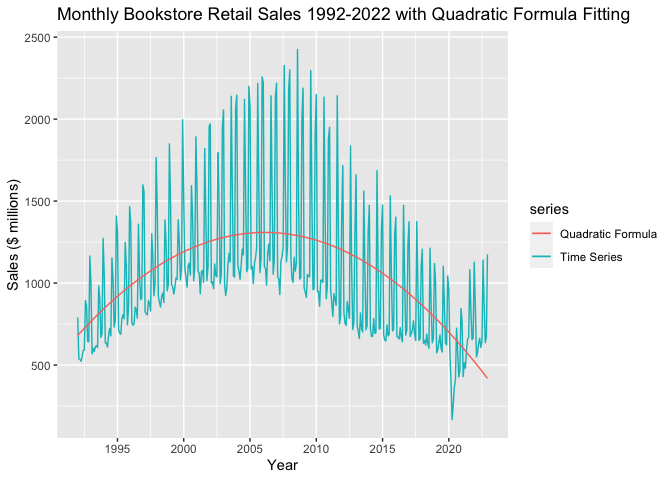

The quadratic formula plot does not fit well against our original time
series plot. Although it captures the general change of the data level,
it underestimates the data and removes the annual data fluctuations that
presents an important quality in the time series plot. In addition, it
asserts that the bookstore retail sales would increase at an increasing
rate before decreasing at a decreasing rate. Furthermore, this quadratic
equation’s range is from negative infinity up until ~\$1.25 billion - so
in terms of predictive power it will not be useful because after the
function reaches the high point at the vertex, it will decrease
constantly towards negative infinity (which is not possible for book
sales). Overall, this model is not a great fit onto our dataset.

## Comparison of In-Sample Accuracies and Model Recommendation

Seasonal Naive: 437.41, Holt Winters: 87.72 ARIMA: 80.78, SARIMA: 80.58,
Linear Regression: (normal) 165.88, (with SARIMA on residuals) 76.66,
(with Box Cox Transformation and SARIMA on residuals) 127.89

In comparing the RMSE values of all of the successful and “good-fit”
models we investigated, we created the following ascending order of
models from the lowest RMSE value (most accurate) to the highest RMSE
value (least accurate):

Linear Regression with SARIMA on residuals \< SARIMA \< ARIMA \< Holt
Winters \< Linear Regression with Box Cox & SARIMA on Residuals \<
Linear Regression \< Seasonal Naive

In comparing the RMSE values of all of the successful and “good-fit”
models we investigated, the linear regression model that applied SARIMA
on its residuals had the lowest RMSE value by far of 76.65521. It is the
most accurate model for this dataset that we have covered in our MA611
Time Series class and is the model that we would recommend using to
create in-sample predictions and forecasts.

## Citations

Atwell, A. (2023, March 15). E-book. Encyclopædia Britannica. Retrieved
from <https://www.britannica.com/technology/e-book>

Cherveny, L. (2023). *MA611: Time Series Analysis Spring 2023 Class
Slides*. Retrieved from <http://lukecherveny.com/ma611spring23/>

National Archives and Records Administration. (n.d.). Brief on
Educational Progress 1992-2000. National Archives and Records
Administration. Retrieved from
<https://clintonwhitehouse4.archives.gov/WH/New/html/edprogress_report.html>

Talbot, Dean. (2022, December 20). Used Book Sales Statistics.
BooksRated. Retrieved from
<https://wordsrated.com/used-books-statistics/#>:~:text=As%20of%202022%2C%20the%20market,of%205.5%25%20from%20%2422.78%20billion.
